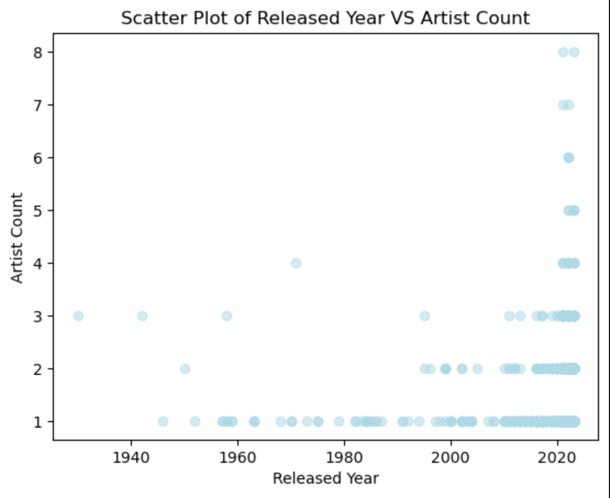
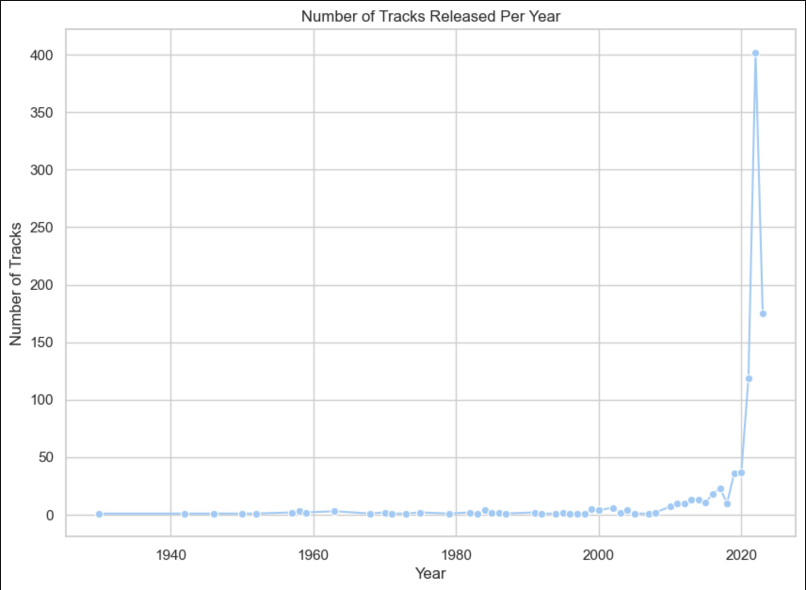
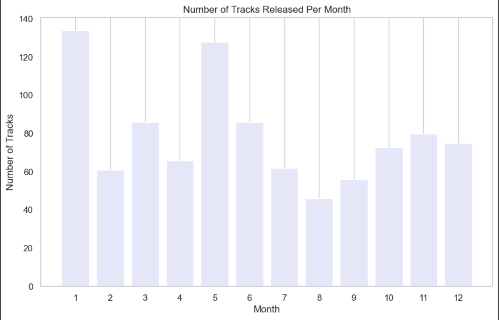
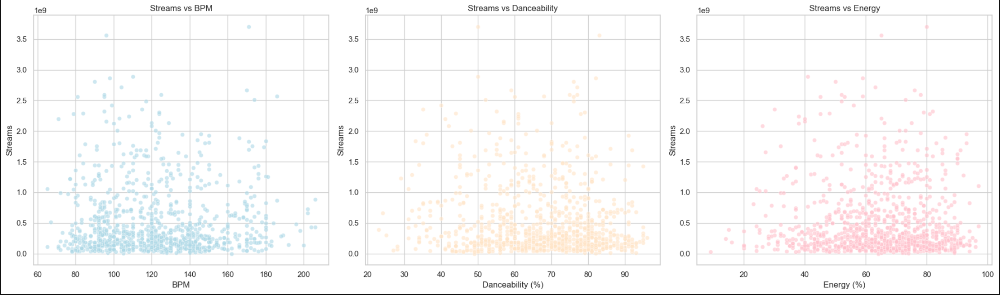
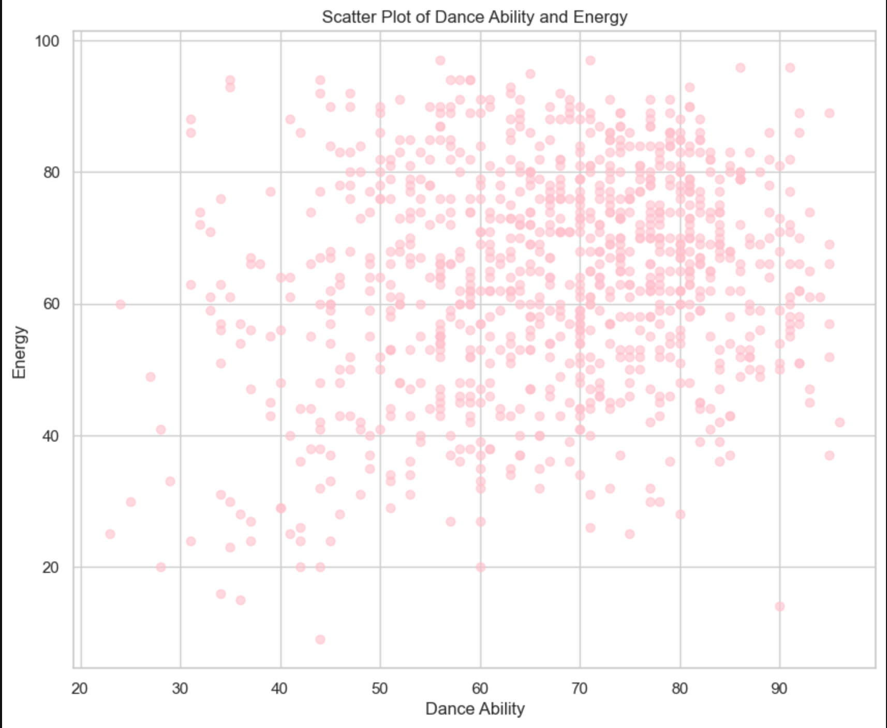
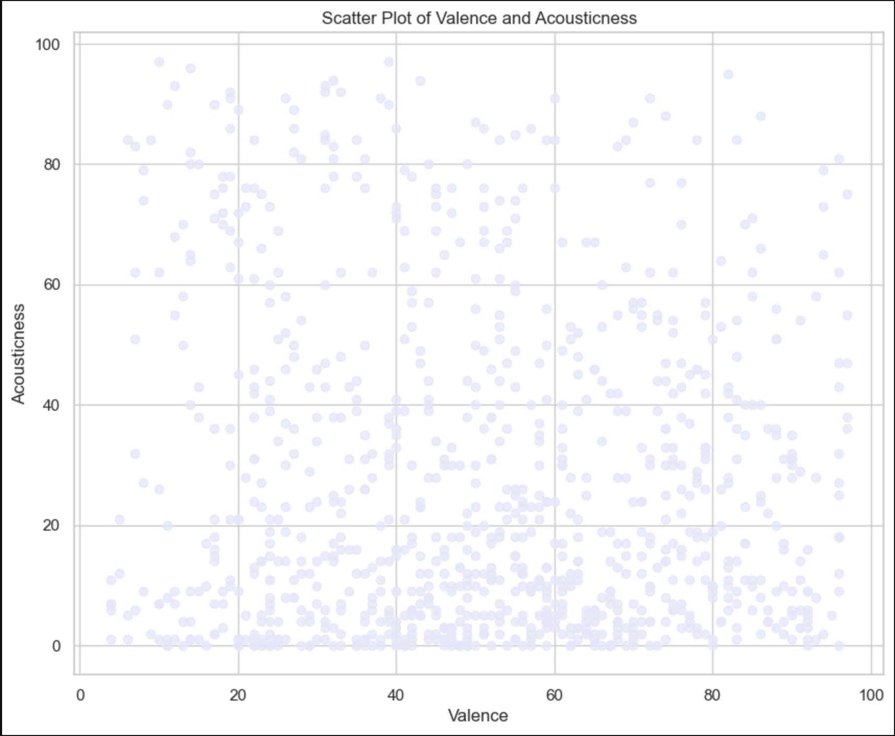
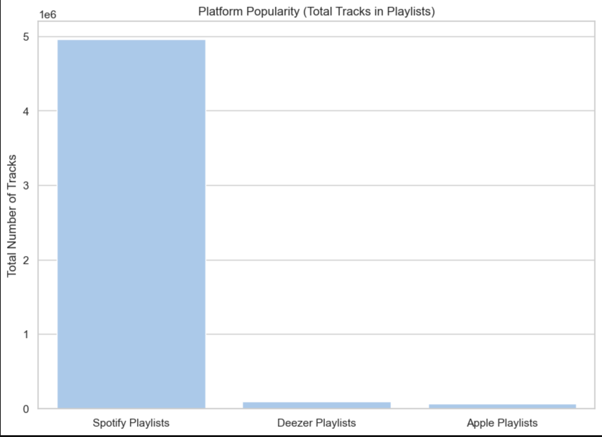
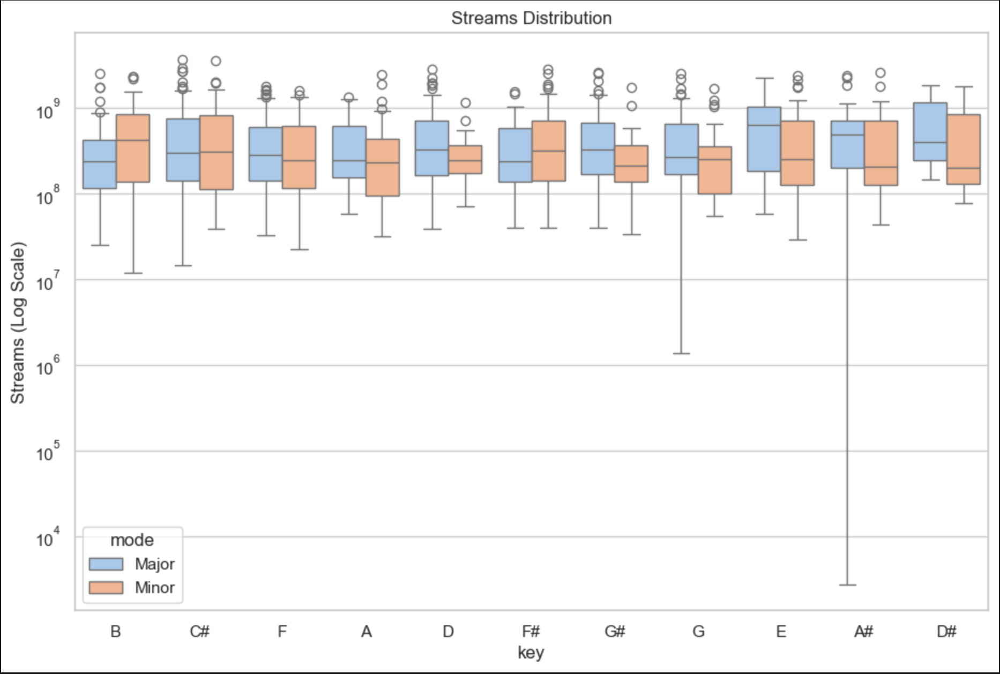
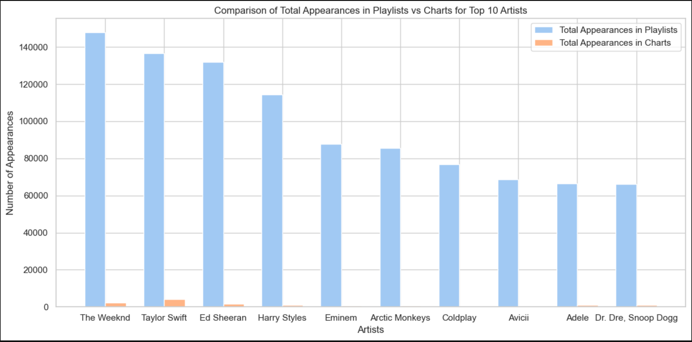

# ˚₊‧꒰ა SPOOF ໒꒱ ‧₊˚

## INTRODUCTION 
This repository uses Python packages like Pandas, Matplotlib, and Seaborn to analyze Kaggle's Most Streamed Spotify Songs 2023. Popular songs with characteristics like BPM, key, mode, and playlist appearances are included in the dataset, which provides information on listener preferences and worldwide music trends.

Top songs, famous singers, and release schedules are all examined. It also looks at the relationship between musical elements like danceability, energy, and stream count to pinpoint the qualities that influence popularity. The specific statistics from Spotify, Deezer, and Apple Music highlight disparities in song representation among streaming services.

The central coding platform used to clean the dataset was Jupyter Notebook. GitHub was used to store and distribute explanations of the Jupyter Notebook results. The core of 2023's most-streamed music, as well as the patterns and trends influencing listener preferences worldwide, are captured in this repository.

☆ 

## ༊*·˚OVERVIEW ₊˚✩
The data frame is approximately 953 x 24 (row x column). The shape of the data frame can be seen using the code below.
```
spoof.shape
```
Each data type in the columns can be seen using the type function in Pandas. 
```
spoof.dtypes
```
| Column               | Data Type |
|----------------------|-----------|
| track_name           | object    |
| artist(s)_name       | object    |
| artist_count         | int64     |
| released_year        | int64     |
| released_month       | int64     |
| released_day         | int64     |
| in_spotify_playlists | int64     |
| in_spotify_charts    | int64     |
| streams              | object    |
| in_apple_playlists   | int64     |
| in_apple_charts      | int64     |
| in_deezer_playlists  | object    |
| in_deezer_charts     | int64     |
| in_shazam_charts     | object    |
| bpm                  | int64     |
| key                  | object    |
| mode                 | object    |
| danceability_%       | int64     |
| valence_%            | int64     |
| energy_%             | int64     |
| acousticness_%       | int64     |
| instrumentalness_%   | int64     |
| liveness_%           | int64     |
| speechiness_%        | int64     |


The table shows a discrepancy with the data types of some columns: in_deezer_playlists, in_shazam_charts, and streams. Using the function pd.to_numeric, the object can be turned to an integer or float while the agreement error =' coerce 'will convert any non-convertible values to NaN (Not a Number). 
```
# Convert the 'streams' column to a numeric type ( while also handling any non-numeric values)

spoof['in_deezer_playlists'] = pd.to_numeric(spoof['in_deezer_playlists'], errors='coerce')
spoof['in_shazam_charts'] = pd.to_numeric(spoof['in_shazam_charts'], errors='coerce')
spoof['streams'] = pd.to_numeric(spoof['streams'], errors='coerce')
```

For further confirmation, the function .info can be used to see the new data types in the data frame.
```
spoof.info()
```
| Column                | Non-Null Count | Data Type |
|-----------------------|----------------|-----------|
| track_name            | 953 non-null   | object    |
| artist(s)_name        | 953 non-null   | object    |
| artist_count          | 953 non-null   | int64     |
| released_year         | 953 non-null   | int64     |
| released_month        | 953 non-null   | int64     |
| released_day          | 953 non-null   | int64     |
| in_spotify_playlists  | 953 non-null   | int64     |
| in_spotify_charts     | 953 non-null   | int64     |
| streams               | 952 non-null   | float64   |
| in_apple_playlists    | 953 non-null   | int64     |
| in_apple_charts       | 953 non-null   | int64     |
| in_deezer_playlists   | 874 non-null   | float64   |
| in_deezer_charts      | 953 non-null   | int64     |
| in_shazam_charts      | 946 non-null   | float64   |
| bpm                   | 953 non-null   | int64     |
| key                   | 953 non-null   | object    |
| mode                  | 953 non-null   | object    |
| danceability_%        | 953 non-null   | int64     |
| valence_%             | 953 non-null   | int64     |
| energy_%              | 953 non-null   | int64     |
| acousticness_%        | 953 non-null   | int64     |
| instrumentalness_%    | 953 non-null   | int64     |
| liveness_%            | 953 non-null   | int64     |
| speechiness_%         | 953 non-null   | int64     |


Missing or null values in the data frame can be seen using two functions: isnull and sum. Combining the two functions will provide the sum of all the null values in each column.
```
spoof.isnull().sum()
```
| Column                | Null Count |
|-----------------------|------------|
| track_name            | 0          |
| artist(s)_name        | 0          |
| artist_count          | 0          |
| released_year         | 0          |
| released_month        | 0          |
| released_day          | 0          |
| in_spotify_playlists  | 0          |
| in_spotify_charts     | 0          |
| streams               | 1          |
| in_apple_playlists    | 0          |
| in_apple_charts       | 0          |
| in_deezer_playlists   | 79         |
| in_deezer_charts      | 0          |
| in_shazam_charts      | 7          |
| bpm                   | 0          |
| key                   | 0          |
| mode                  | 0          |
| danceability_%        | 0          |
| valence_%             | 0          |
| energy_%              | 0          |
| acousticness_%        | 0          |
| instrumentalness_%    | 0          |
| liveness_%            | 0          |
| speechiness_%         | 0          |


To fill the missing values of each of the numeric columns the fillna function can be used while the previous code can be used again to confirm if the missing values were filled.
```
# Fill all null values of the numeric columns 

spoof['streams'] = spoof['streams'].fillna(0)
spoof['in_deezer_playlists'] = spoof['in_deezer_playlists'].fillna(0)
spoof['in_shazam_charts'] = spoof['in_shazam_charts'].fillna(0)

spoof.isnull().sum()
```
| Column                | Null Count |
|-----------------------|------------|
| track_name            | 0          |
| artist(s)_name        | 0          |
| artist_count          | 0          |
| released_year         | 0          |
| released_month        | 0          |
| released_day          | 0          |
| in_spotify_playlists  | 0          |
| in_spotify_charts     | 0          |
| streams               | 0          |
| in_apple_playlists    | 0          |
| in_apple_charts       | 0          |
| in_deezer_playlists   | 0          |
| in_deezer_charts      | 0          |
| in_shazam_charts      | 0          |
| bpm                   | 0          |
| key                   | 0          |
| mode                  | 0          |
| danceability_%        | 0          |
| valence_%             | 0          |
| energy_%              | 0          |
| acousticness_%        | 0          |
| instrumentalness_%    | 0          |
| liveness_%            | 0          |
| speechiness_%         | 0          |

☆ 

## ༊*·˚STREAMS ₊˚✩
Using the functions mean, median, and std, their corresponding values can be found.
```
spoof['streams'].mean()
spoof['streams'].median()
spoof['streams'].std()
```
| Statistic            | Value             |
|----------------------|-------------------|
| Mean                 | 514,137,424.94    |
| Median               | 290,530,915.0     |
| Standard Deviation   | 566,856,949.04    |


Although Matplotlib offers several plots, a scatter plot was employed to simplify the distribution of released_year and artist_count. This can be achieved by using the function plt.scatter.
```
# import matplot

import matplotlib.pyplot as plt

# Scatter plot for released_year vs artist_count

plt.scatter(spoof['released_year'], spoof['artist_count'], alpha=0.5, color='lightblue')
plt.xlabel('Released Year')
plt.ylabel('Artist Count')
plt.title('Scatter Plot of Released Year VS Artist Count')
plt.show()
```



### ୧ ‧₊˚Trends and Outliers₊˚⊹♡

Trends
- The plot shows an increase in the number of songs released over time, especially from 2000 to 2020, where there is a dense cluster of data points. In the earlier years, from 1940 to 2000, collaborations between artists were minimal, with most releases involving only one or two artists. After 2000, artist collaborations became more common, as indicated by the higher artist counts.

Outliers
- Artist counts above 3 are sparse from 1940 to 2000, with only one notable outlier showing an artist count of 4. Although collaborations increased steadily after 2000, releases with more than four artists remain relatively rare. For example, there are only two data points each for artist counts of 5, 7, and 8, and just one data point for an artist count of 6. These values are still low compared to releases with artist -counts below 3, which are far more common.

## ༊*·˚TOP PERFORMERS ₊˚✩

The sort_values function sorts the rows of the data frame based on the specified column, 'streams' in this case. By setting the ascending=False argument, the values are sorted in descending order, meaning the rows with the highest number of streams will appear first. After sorting, the head(5) function automatically selects and displays the top 5 rows from the sorted data frame, corresponding to the five rows with the highest stream counts.
```
# most streamed song

top = spoof.sort_values("streams", ascending = False).head(5)
top
```

The groupby function groups the data frame by the specified column, 'artist(s)_name', meaning all rows with the same artist name will be grouped. The size function is then used to count the number of rows within each group, effectively giving the number of tracks each artist has. Since the result of the size function is a Series (where the artist names become the index and the track count is the value), the reset_index function is used to convert this Series back into a data frame. The name='count' argument in reset_index renames the count column to 'count,' meaning that this column represents the number of tracks for each artist. The sort_values function is again used to sort the data frame rows based on the new column, 'count,' and by setting the ascending=False argument, the values are sorted in descending order. The head(5) function selects and displays the top 5 rows from the sorted data frame, returning the top 5 most frequent artists.
```
# Group by artist and count the number of tracks they have

count = spoof.groupby('artist(s)_name').size().reset_index(name='count')

# Sort the values in descending order and Find top 5 artist

top_5 = count.sort_values(by='count', ascending=False).head(5)

# Print 

top_5
```
| artist(s)_name | count |
|-----------------|-------|
| Taylor Swift    | 34    |
| The Weeknd      | 22    |
| SZA             | 19    |
| Bad Bunny       | 19    |
| Harry Styles    | 17    |

☆

## ༊*·˚TEMPORAL TRENDS ₊˚✩
Importing Seaborn, a visualization Library, will enhance the aesthetics of the plot. Next, the data frame is grouped by released_month and released_year columns and uses value_counts() to count the occurrences for each month and year; the function sort_index() is used to arrange the counts chronologically.

This first plot is a line chart of the tracks by year, where a Seaborn theme called whitegrid and a pastel color palette are applied. The figure size is set to 10x7 inches. The line plot is created with the years plotted along the x-axis and the count of tracks plotted along the y-axis. A marker has been added at every data point for visibility. Titles and axis labels have been added to the plot for more straightforward interpretation, and finally, plt.show() to view the plot.
```
import seaborn as sns

# Count the number of tracks released per year

tracks_year = spoof['released_year'].value_counts().sort_index()

# Theme 

sns.set_theme(style="whitegrid", palette="pastel")

# Figure size

plt.figure(figsize=(10, 7))

# Count the number of released songs per year

sns.lineplot(x=tracks_year.index, y=tracks_year.values, marker='o')

# Titles and names for the variables

plt.title('Number of Tracks Released Per Year')
plt.xlabel('Year')
plt.ylabel('Number of Tracks')
plt.grid(True)

# print plot

plt.show()
```

The second plot is a bar chart of track numbers by month. The figure size was set to 10x6 inches with a bar plot colored pink. These bars use months on the x-axis and track counts on the y-axis. For further context, titles, axis labels, and x-axis ticks are used, while the lines along the y-axis are used for readability. Finally, the plot is displayed using plt.show().
```
# Count the number of tracks released per month

tracks_month = spoof['released_month'].value_counts().sort_index() 

# Figure size

plt.figure(figsize=(10, 6))

# Count the number of released songs per month

plt.bar(tracks_month.index, tracks_month.values, color='lavender')

# Titles and names for the variables

plt.title("Number of Tracks Released Per Month")
plt.xlabel("Month")
plt.ylabel("Number of Tracks")
plt.xticks(range(1, 13))  
plt.grid(axis='y')

# print plot

plt.show()
```

The monthly release patterns reveal that, while there is no clear overall trend, certain months show noticeable boosts in music releases, particularly in January and May. Seasonal factors may also play a role, with months like November and December seeing slight increases due to the holiday season. However, this boost is limited, as holiday songs, especially Christmas, often resurface classic Christmas songs or covers of classic Christmas songs. Overall, the release pattern remains relatively evenly distributed throughout the year, with notable peaks in January and May and a noticeable decline in August. 


The number of tracks per year has continually grown, especially over the early 2000s. For nearly its whole history, release quantities have been low and unchanging. However, it began skyrocketing in the first few years of the twenty-first century. This steady climb might be owed to increased opportunities in digital distribution, alongside the new platforms of streaming that have become available, which makes the artist put his music more often online while making audiences reach these recordings worldwide. In 2020, there was a significant upsurge in output, and the nature of the data frame compiled could account for this spike.

Since this dataset focuses on the most listened-to songs of 2023, it is heavily concentrated on tracks released from 2020 onward. With digital streaming continuing to grow as an industry and recent music aligning with current trends, these newer songs naturally generate more streams. This also explains the sparse releases from 1940 to the early 2000s, as songs from those decades may no longer resonate with today's listeners or fit modern trends, making them less likely to appear in the most-streamed lists.


☆

## ༊*·˚GENRE AND MUSIC CHARACTERISTICS ₊˚✩ 
This code produces a figure with three scatter plots exploring the relationship between music streaming attributes and musical attributes. Using the plt.subplots function will create a figure with one row, and, in that row, three subplots are defined in terms of an array as used to refer to each subplot. The first scatter plot is axs[0], showing the relationship between beats per minute and the number of streams; the second plot is axs[1], considering the relationship between danceability and streams; and the third plot is axs[2], which is on energy levels related to streams. The scatter plots are created by sns.scatterplot, where the index of the axs array defines each subplot.  All the plots are customized based on colors, transparency, titles, and axis labels for better visibility and clarity. The function tight_layout is used to adjust layouts to increase the readability of plot titles and labels.
```
# Set up the visual style for the plots

fig, axs = plt.subplots(1, 3, figsize=(20, 6))

# Plot: Streams vs BPM

sns.scatterplot(data=spoof, x='bpm', y='streams', ax=axs[0], color="lightblue", alpha=0.6)

# Titles and names for the variables

axs[0].set_title('Streams vs BPM')
axs[0].set_xlabel('BPM')
axs[0].set_ylabel('Streams')

# Plot: Streams vs Danceability

sns.scatterplot(data=spoof, x='danceability_%', y='streams', ax=axs[1], color="bisque", alpha=0.6)

# Titles and names for the variables

axs[1].set_title('Streams vs Danceability')
axs[1].set_xlabel('Danceability (%)')
axs[1].set_ylabel('Streams')

# Plot: Streams vs Energy

sns.scatterplot(data=spoof, x='energy_%', y='streams', ax=axs[2], color="pink", alpha=0.6)

# Titles and names for the variables

axs[2].set_title('Streams vs Energy')
axs[2].set_xlabel('Energy (%)')
axs[2].set_ylabel('Streams')

# print plot

plt.tight_layout()
plt.show()
```

### ୧ ‧₊˚Streams vs. Musical Attributes₊˚⊹♡


Streams vs BPM
- The relationship between BPM and streams reveals little of a connection. Data points are scattered across the plot, with no noticeable upward or downward trend. Although streams are slightly higher in the 80 to 120 BPM range, they are still insignificant enough to indicate a clear pattern. Even BPMs between 160 and 180 reach similar streaming levels, reinforcing that BPM does not strongly influence streaming numbers.

Streams vs danceability (%)
- A similar lack of correlation appears with danceability. The data points are spread widely, showing no distinct trend between higher danceability percentages and streaming numbers. While slightly higher streams are seen in the 40% to 80% range, high streaming numbers still appear outside this band (notably in the 80%-90% and 30%-40% ranges). This suggests that danceability does not directly impact a song's streaming performance.

Streams vs energy (%)
- Energy only affects streams a little, too. Although energy levels between 40% and 80% show more songs with high streams, there are also tracks with substantial streaming numbers at lower energy levels, around 20%. The absence of a clear trend suggests that energy is not a significant driver of streaming success.

Overall Relationship between Streams and Musical Attributes
- BPM, danceability, and energy do not significantly impact a song's streaming numbers. These musical attributes alone are insufficient to explain streaming performance, indicating that other factors, such as the artist's popularity, genre, and marketing reach, likely play a more influential role. If anything, BPM shows a slight edge, with higher streams observed in the 80 to 120 BPM range. This could be due to genre preferences, as hip-hop—a popular genre on platforms like Spotify—often falls within this BPM range (Spotify, 2023).

### ୧ ‧₊˚Musical Attributes: Comparison₊˚⊹♡
Danceability (%) vs Energy (%)
- The plt.scatter function plots the data from the data frame, with danceability_% as the x-axis and energy_% on the y-axis. Each data point is displayed in pink, and an alpha parameter of 0.6 makes the points slightly transparent, helping to visualize overlapping points more effectively. Each axis is labeled for context using the functions plt.xlabelfor the x-axis and plt.ylabel for the y-axis. The chart is also given a title through plt.title, indicating the plot's representation.
```
# Figure size

plt.figure(figsize=(10, 8))

# Scatter plot for danceability_% and energy_%

plt.scatter(spoof['danceability_%'], spoof['energy_%'], alpha=0.6, color='pink')

# Names for the variables

plt.xlabel('Dance Ability')
plt.ylabel('Energy')
plt.title('Scatter Plot of Dance Ability and Energy')

# print plot

plt.show()
```

- The marks for plot and danceability are scattered on the graph, which suggests that these qualities probably do not correlate so well. Much more correlation would have a trend or clustering either upwardly or downwardly. The points having a random scattering around this chart means that energy does not rise or fall in such a predictable fashion as with danceability rising.


Valence (%) vs Acousticness (%)
- The data from the data frame is plotted using the plt.scatter function, with valence_% on the x-axis and acousticness_% on the y-axis. To better visualize overlapping dots, each data point is shown in lavender with an alpha setting of 0.8, which makes the points somewhat transparent. The routines plt.xlabel for the x-axis and plt.ylabel for the y-axis are used to label each axis for context. Additionally, plt.title is used to provide the chart with a title that identifies the plot.
```
# Figure size

plt.figure(figsize=(10, 8))

# Scatter plot for valence_% and acousticness_%? 

plt.scatter(spoof['valence_%'], spoof['acousticness_%'], alpha=0.8, color='lavender')

# Names for the variables

plt.xlabel('Valence')
plt.ylabel('Acousticness')
plt.title('Scatter Plot of Valence and Acousticness')

# print plot

plt.show()
```

- The plot for valence and acoustics shows a scattered distribution with no apparent linear pattern. This lack of a trend implies valence and acoustics are not strongly correlated. If these two attributes had a strong relationship, a visible trend should be visible where the variables are either proportional or vice versa. However, the points are evenly spread throughout the plot, meaning the variables do not significantly impact one another.


☆

## ༊*·˚PLATFORM POPULARITY ₊˚✩
The platforms are defined by "Spotify Playlists," "Deezer Playlists," and "Apple Playlists,". While the count's array was a sum of total track counts for each platform inside spoof['in_spotify_playlists'], spoof['in_deezer_playlists'], and spoof['in_apple_playlists'] using the sum function. Using sns.barplot, the chart shows the platform names on the x-axis and the associated total track counts on the y-axis. For the y-axis and the title, the functions plt.title and plt.ylabel were used to produce the title and label for the y-axis. 
```
# Set a pastel theme for the plots

sns.set_theme(style="whitegrid", palette="pastel")

# Platform Popularity Plot

platforms = ['Spotify Playlists', 'Deezer Playlists', 'Apple Playlists']
counts = [spoof['in_spotify_playlists'].sum(), spoof['in_deezer_playlists'].sum(), spoof['in_apple_playlists'].sum()]

# Figure size
    
plt.figure(figsize=(10, 7))

# Names for the variables
    
sns.barplot(x=platforms, y=counts)
plt.title("Platform Popularity (Total Tracks in Playlists)")
plt.ylabel("Total Number of Tracks")

# print plot

plt.show()
```

From the visualization, it is clear that Spotify favors popular tracks more, as the number of tracks in playlists is more significant than that of Deezer and Apple Music. This difference might mean Spotify has more users who create or use more playlists or possesses a much broader collection of popular tracks added to playlists. It also matches that Spotify is the most widely used streaming service, with 350 million users and 150 million subscribers (CNN, 2024).

On the other hand, the number of tracks on Deezer and Apple Music's playlists is much smaller. This might be attributed to their smaller user base as compared to others. For instance, Deezer has around 10.5 million subscribers (Deezer, 2024), and Apple Music has around 93 million (DemandSage, 2024). The difference in the number of subscribers leads to a difference in activity and popularity in playlists.


☆

## ༊*·˚ADVANCED ANALYSIS ₊˚✩
Sns.boxplot, which, in this case, plots across different musical keys on the x-axis and the y-axis as the count of streams. The data frame further splits the data down to mode major/minor by setting the hue parameter so each essential mode gets assigned a separate color for comparison. Use the y-axis logarithm scaling (plt.yscale('log')) to see through the wide range on stream counts to better visualize this plot by compressing the extreme values. Finally, the plot is titled "Streams Distribution," and the y-axis is labeled "Streams (Log Scale)" for context.
```
# Figure size
    
plt.figure(figsize=(11, 7))

# Patterns in Streams by box plot

sns.boxplot(x='key', y='streams', hue='mode', data=spoof, palette="pastel")

# Titles and names for the variables

plt.title("Streams Distribution")
plt.ylabel("Streams (Log Scale)")
plt.yscale('log')

# print plot

plt.show()
```
The box plot shows an interesting pattern: minor keys tend to outperform major keys in the number of streams. In other words, minor keys, often connected with deeper emotions, are more relatable to the audience. Though major keys seem more balanced, minor keys usually have a higher median and a longer tail, meaning more tracks have very high stream counts. This phenomenon might be due to several reasons, including emotional resonance or preference for specific genres. Moreover, songs of a "sad" or moody nature tend to be in minor keys. Although this is not an absolute rule, it is broadly accepted that in comparison with major keys, minor keys are more effective in communicating a somber or emotional tone to the listener.

The function explodes: This explodes each artist's name into separate rows in the spoof data frame's artist(s)_name column. This "unpacks" rows with multiple artists to give each artist their row. Therefore, any track credited with multiple artists will have separate rows for each artist so that they can be counted individually. Two lists were created: playlist_columns and chart_columns; these hold column names to track appearances in playlists and charts across platforms. Then, the following code groups the data frame by the column artist(s)_name and sums each artist's appearances across all the specified playlists and charts with those column names. 


The total number of playlists and charts is calculated for each artist by adding the corresponding columns. Total_playlists calculates all playlist-related appearances, whereas total_charts sums all chart appearances, giving the best overall view of an artist's appearance on playlists and charts. The artists are then sorted by total_playlists and total_charts in descending order, thus giving precedence to artists with the highest total visibility on different platforms. head(10) selects only the top 10 artists.
```
# Artist appears in a separate row by exploding the 'artist(s)_name' 

spoof_exploded = spoof.explode('artist(s)_name')

# Names for the variables

playlist_columns = ["in_spotify_playlists", "in_apple_playlists", "in_deezer_playlists"]
chart_columns = ["in_spotify_charts", "in_apple_charts", "in_deezer_charts", "in_shazam_charts"]

# Group by artist name and calculate total appearances in playlists and charts

both = spoof_exploded.groupby('artist(s)_name')[playlist_columns + chart_columns].sum()

# Calculate the total appearances in playlists and charts separately

both['total_playlists'] = both[playlist_columns].sum(axis=1)
both['total_charts'] = both[chart_columns].sum(axis=1)

# Sort and display the top 10 artists across playlists and charts

f_artists = both.sort_values(
    ['total_playlists', 'total_charts'], ascending=False
)
top_10 = f_artists.head(10)

# Display the results
print("Top 10 Artists by Appearances in Playlists and Charts Across All Platforms:")
print(top_10[['total_playlists', 'total_charts']])
```
| artist(s)_name       | total_playlists | total_charts |
|----------------------|-----------------|--------------|
| The Weeknd           | 147,868.0       | 2,405.0      |
| Taylor Swift         | 136,478.0       | 4,277.0      |
| Ed Sheeran           | 131,908.0       | 1,499.0      |
| Harry Styles         | 114,250.0       | 1,088.0      |
| Eminem               | 87,806.0        | 717.0        |
| Arctic Monkeys       | 85,427.0        | 637.0        |
| Coldplay             | 76,902.0        | 107.0        |
| Avicii               | 68,648.0        | 426.0        |
| Adele                | 66,551.0        | 1,035.0      |
| Dr. Dre, Snoop Dogg  | 66,011.0        | 1,073.0      |

For every artist, there is a bar for playlist appearances and a bar for chart appearances. A width of 0.35 is set for each bar, and the index sets the positions down the x-axis for each artist. Now the code plots everything using plt.xlabel for "Artists," plt.ylabel for the y axis, and plt.title for giving a title to the entire chart,  "Comparison of Total Appearances in Playlists vs Charts for Top 10 Artists." Finally,  plt.xticks will place the artist names at the middle of the bar pair and set the rotation to 360 degrees to align the artist names horizontally. Finally, plt.tight_layout ensures proper layout without overlap of elements so that everything gets nicely accommodated within the figure.
```
# Figure size and range

plt.figure(figsize=(12, 6))
bar_width = 0.35
index = range(len(top_10))

# Bar chart for total playlists and total charts appearances

plt.bar(index, top_10['total_playlists'], bar_width, label='Total Appearances in Playlists')
plt.bar([i + bar_width for i in index], top_10['total_charts'], bar_width, label='Total Appearances in Charts')

# Titles and names for the variables

plt.xlabel('Artists')
plt.ylabel('Number of Appearances')
plt.title('Comparison of Total Appearances in Playlists vs Charts for Top 10 Artists')
plt.xticks([i + bar_width / 2 for i in index], top_10.index, rotation=360)
plt.legend()
plt.tight_layout()

# print plot

plt.show()
```
An analysis of playlist and chart data reflects consistent presence by some of the industry's most prominent artists on crucial platforms, demonstrating widespread popularity and demand. The most prominent artists who appear in playlists and charts are The Weeknd, Taylor Swift, Ed Sheeran, Harry Styles, Eminem, Arctic Monkeys, and Coldplay. These artists have otherwise 
dominated the most curated lists and charts because of their broad appeal and substantial fan bases. Their influence can thus be attributed to popularity, cross-genre appeal, and practical strategies of fan engagement that amplify their influence within the streaming industry.

Taylor Swift was crowned the Most Famous Artist of 2023, acknowledging her significant influence and cultural trends worldwide. Harry Styles' song "As It Was" was the third most streamed song, and The Weeknd's Starboy ranked as the third most successful album globally, proving his current trend in music charts. Many artists constantly appearing on these playlists are indeed superstars widely recognized for their frequent presence in the international top 10 based on album strength, song, and overall artist power (Spotify, 2023). The fact that these established artists dominate the playlists is a testament to the power of their loyal fan base and general appeal.


☆

## ༊*·˚Reference ₊˚✩
[Nearly a Quarter of All Streams on Spotify Are Hip-Hop. Spotify's Global Editors Reflect on the Genre's Growth — Spotify](https://newsroom.spotify.com/2023-08-10/hip-hop-50-murals-new-york-atlanta-miami-los-angeles/)
[Best music streaming services in 2024 | CNN Underscored](https://edition.cnn.com/cnn-underscored/reviews/best-music-streaming-service#:~:text=We%20found%20Tidal%20to%20be,royalty%20payouts%20for%20music%20artists.&text=The%20best%20music%20streaming%20services,Tidal%20manages%20to%20do%20both.)
[ Deezer FY23 Results: Strong performance and momentum; reiterating financial targets for 2024 & 2025 - Deezer Newsroom](https://www.demandsage.com/apple-music-statistics/#:~:text=As%20of%202024%2C%20Apple%20Music%20has%2030.7%25%20of%20the%20subscriber,its%20revenue%20reached%20%249.2%20billion.)
https://www.kennedy-center.org/education/resources-for-educators/classroom-resources/media-and-interactives/media/music/your-brain-on-music/your-brain-on-music/your-brain-on-music-tearjerkers/
https://newsroom.spotify.com/2023-11-29/top-songs-artists-podcasts-albums-trends-2023/
Thank you so much to my one and only partner: ChatGpt ໒꒰ྀི っ ⸝⸝ ˂ ꒱ྀིა


# ᘏ  ⑅  ᘏ  ഒ   zᶻ
# ꒰˶ - ˕ -꒱ ⌒)ᦱ
